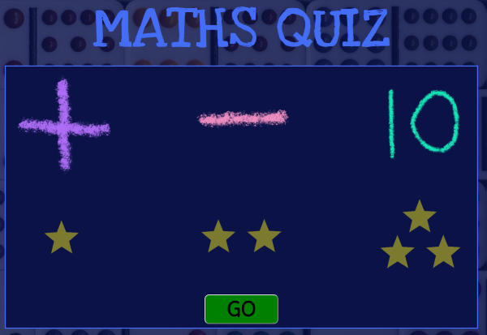
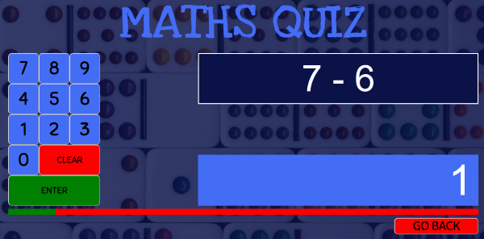
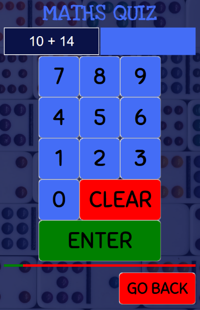
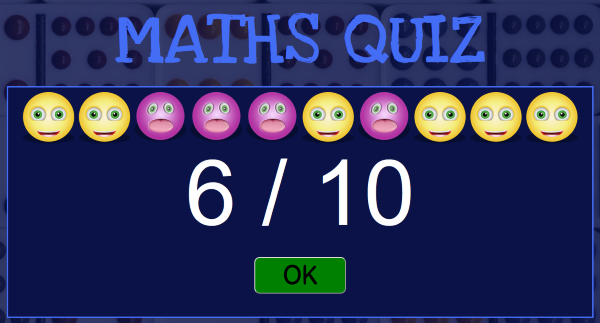

# Maths Quiz

## About the Project
  I began working on this when beginning my coursework in Full Stack Development. As my daughter was 5 and a half at the time and learning basic mathematics, I thought a maths game would be a sound first project idea. I set out to create a maths game for my daughter with the following points in mind:

 * Basic addition and subtraction, using formal mathematical notation.
 * Aimed at children aged 5 - 7, specifially for dealing with formal, abstract mathematical notation.
 * Simple child-frendly interface requiring minimal adult assistance
 * Adaptability between large or small screen devices
 * Keyboard, mouse, and touch interactivity.

 At the time, I had only explored HTML5, CSS3, and vanilla JavaScript without having yet learned React, Bootstrap, or any other frameworks or libraries.

## Features

- **Game Modes**: Choose from three different game modes: addition, subtraction, and friends of 10.
- **Difficulty Levels**: Each mode includes three difficulty levels to cater to different learning stages.
- **Interactive Interface**: Designed with touch-friendly number buttons for ease of use on both desktop and mobile devices.
- **Keyboard Support**: Users can input answers using the keyboard (numbers, delete, backspace and enter key) in addition to clicking or touching buttons.
- **Progress Tracking**: The game keeps track of questions using a progress bar to show users how far through a game they are.
- **Results Display**: At the end of each game session, results are displayed with animated emoticons (smiley for correct answers, funny face for incorrect answers).
- **Exit Option**: Users can exit the game at any time using the provided exit button.

## Game Modes

- **Addition**: Generates random addition problems within a specified range, ensuring positive results.
- **Subtraction**: Generates random subtraction problems, ensuring no negative-number answers.
- **Friends of 10**: Presents number problems where the sum is 10, and the user needs to find the number corresponding with the number provided to add to 10. This reinforces basic arithmetic relationships.

## User Interface Details

- Interactive number buttons with click animations and hover effects.
- Feedback for correct and incorrect answers using sounds.
- Exit button prominently displayed for easy game termination.

## Game Logic

- Answers are validated with exact matching, ensuring precise correctness.
- Random number generation is controlled to provide a mix of difficulty levels and problem types.
- Game keeps track of generated maths probelms that are given to ensure a specific maths probelm does not appear more than once per game.
- Additional features include a timing mechanism to animated results at end of game.

## Accessibility and Responsiveness

- Keyboard navigation enabled for gameplay as well as buttons for touch-devices.
- Responsive design adapts to different screen sizes and orientations.
- ARIA roles and attributes used to enhance accessibility for screen readers.

## What was Learnt During Production
This was my first independent project, which I undertook with perhaps a somewhat novice level of knowledge at the time. I feel that knowledge however, was utilised well. Much focus in producing this maths game was adaptability to multiple devices. This proved to be of considerable challenge. This was perhaps Adding sufficient accessibility features to this game was also a challenge, and will perhaps be modified futher in future.

## Potential Future Developments
While I focussed only on formal abstract mathematical notation- where symbolic numbers and operational symbols were used, I would consider focussing also on concrete number representation (eg. 4 apples put together with 6 apples). This would be to reinforce the relationship between concrete and symbolic representation of numbers. I would also consider expanding the target demograpic to older and younger children than the 5 - 7 age range. I would like to encompass more operations (eg. multiplication and division) as well as features to give users more freedom in determining range of number sizes (eg. 1 t0 10 or 1 to 1000) or even negative numbers or fractions. A more diverse set of game modes would likely achieve more.

## Screenshots









## Getting Started

To run this project locally, clone the repository and open `index.html` in your web browser. Alternativele, play it by visiting: https://simonwindsor.github.io/Maths-Quiz/

```bash
git clone https://github.com/SimonWindsor/Maths-Quiz
cd Maths-Quiz
```
## Acknowledgements
  * [GitHub Pages](https://pages.github.com/)
  * [Google Fonts](https://fonts.google.com/)
  * [Pixabay](https://pixabay.com) - with specific credit to users with credit to u_31vnwfmzt6 and UNIVERSFIELD
  * [Unsplash](https://unsplash.com) - with specific credit to users Nina Garman and Mick Haupt.
