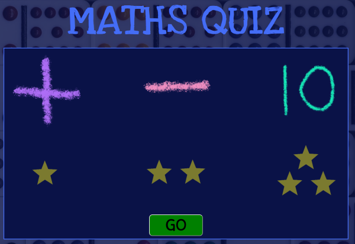
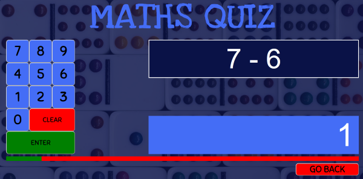
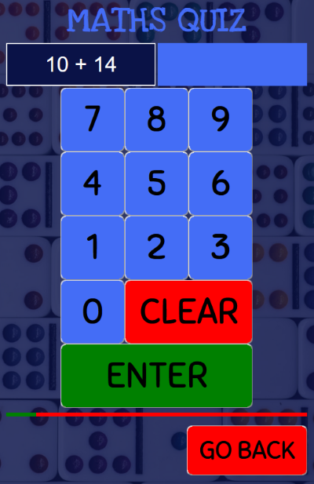
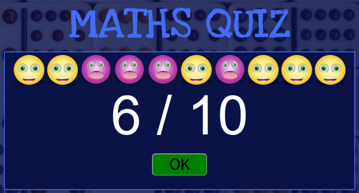

# Maths Quiz

*[Click to see this project in action](https://simonwindsor.github.io/Maths-Quiz/)*

## About the Project
I began working on this project early in my Full Stack Development coursework. My daughter was 5½ at the time and learning basic mathematics, so creating a maths game for her felt like a meaningful first project.

My goals were:

- Basic addition and subtraction using formal mathematical notation  
- Aimed at children aged 5–7  
- A simple, child-friendly interface requiring minimal adult assistance  
- Adaptability between large and small screens  
- Keyboard, mouse, and touch interactivity  

At this stage I had only learned HTML5, CSS3, and vanilla JavaScript — no frameworks such as React or Bootstrap.

## Features

- **Game Modes**: Addition, subtraction, and “friends of 10”
- **Difficulty Levels**: Three levels per mode  
- **Interactive Interface**: Designed for touch, mouse, and keyboard use  
- **Keyboard Support**: Numbers, delete/backspace, and enter  
- **Progress Tracking**: Progress bar showing game completion  
- **Results Display**: Animated emoticon feedback at the end of each session  
- **Exit Option**: “Go back” button available at any time  

## Game Modes

- **Addition**: Random addition problems within controlled ranges  
- **Subtraction**: Random subtraction problems that never produce negative answers  
- **Friends of 10**: Identify the complementary number that sums to 10  

## User Interface Details

- Touch-friendly number buttons with animations  
- Sound feedback for correct/incorrect answers  
- Prominent exit button  

## Game Logic

- Exact answer validation  
- Controlled random number generation  
- Each maths problem appears only once per game  
- Timer to animate results at the end of the game  

## Accessibility and Responsiveness

- Full keyboard navigation  
- Responsive layout for multiple screen sizes  
- ARIA roles and attributes for screen reader support  

## What Was Learned
This was my first independent project, and I gained a lot of experience in designing for multiple device types and making a game accessible. Accessibility and responsive design presented the biggest challenges, and I plan to continue improving both areas.

## Potential Future Developments

- Adding concrete number representations (e.g., apples) to reinforce conceptual understanding  
- Expanding the target age range  
- Adding multiplication, division, and larger number ranges  
- Options for negative numbers or fractions  
- Additional game modes  

## Screenshots









## Getting Started

To run this project locally:

```bash
git clone https://github.com/SimonWindsor/Maths-Quiz
cd Maths-Quiz
